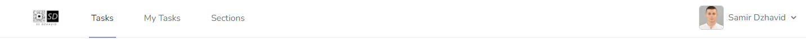

<h1 align="center">Samir's Task Application</h1>

## Description

This is a Laravel 8 application which enables users to:
    <ol>
        <li>Create accounts and login into the system. The user can also login using GitHub, Facebook and Google</li>
        <li>Reset the password for an existing account via access given my a link which is sent on the email address of the account.</li>
    </ol>
    
A logged in user can: 

    <ol>
        <li>perform CRUD opeartions on tasks, comments and sections.</li>
        <li>search through the tasks.</li>
        <li>leave comments on the tasks. They can also reply to comments</li>
        <li>assign tasks to sections.</li>
        <li>Logout from the system.</li>
    </ol>
    The application: 
    <ol>
        <li>Stores the resources onto a database.</li>
        <li>Validates the user input when creating an account, comment, section or a task.</li>
    </ol>

## Build With

<ul>
    <li>Laravel 8</li>
    <li>Tailwind CSS</li>
    <li>Laravel Socialite</li>
    <li>Laravel Kyslik's column-sortable</li>
</ul>

## Getting Started

<h3>Prerequisites</h3>

In order to run the application you will need the following: 

<ul>
    <a href="https://getcomposer.org/doc/00-intro.md"><li>Composer</li></a>
    <a href="https://www.php.net/manual/en/install.php"><li>PHP</li></a>
    <li>A database management system (e.g. mySQL)</li>
    <a href="https://docs.npmjs.com/downloading-and-installing-node-js-and-npm"><li>Node & Npm</li></a>
</ul>

<h3>Installation</h3>

    <ol>
        <li>
            Clone the repository    git clone "the_repsitory_url.com"  
        </li> 
        <li>
            Run the following commands from the root directory of the project   
            composer.phar install  
            npm install  
            npm run dev  
        </li> 
        <li>
            Create a text file called exactly .env in the root directory 
        </li> 
        <li>
            Copy the content of the .env.example and paste into the previously created .env file
        </li> 
        <li>
            Create a database using some database management system
        </li> 
        <li>
            Modify the following DB variables in the .env file to match your DB credentials.    
            DB_CONNECTION =  
            DB_HOST =  
            DB_PORT =  
            DB_DATABASE =  
            DB_USERNAME =  
            DB_PASSWORD =  
         </li> 
        <li>
            From the root directory run the following command to generate a key:   
            php artisan key:generate
        </li> 
        <li>
            Run the DB migrations and seeders with the following commands:   
            php artisan migrate  
            php artisan db:seed  
        </li> 
        <li>
            Serve the project by executing:   
            php artisan serve    
            The address that will be used to access the application will appear in the console.   It should be something like 127.0.0.1
        </li> 
        <li>(Optional) - In order the third party authentication and forgotten password features to work, do the following:</li> 
        <ol>
            <li>Copy and <strong>PASTE</strong> lines 50-60 from the .env.example file into your newly created .env file.</li> 
            <li>Copy and <strong>REPLACE</strong> lines 30-37 from the .env.example file into your newly created .env file</li> 
        </ol>
    </ol>

## Usage

<h4>Welcome Screen</h4>

This is the page which will appear once you start the application. From this page you can access the login page or the register page by clicking on the buttons.

<h4>Login Screen</h4>

Using this page you can log in the system. If you ran the seeders correctly you should be able to login with those details:  Email: test@email.com Password: 123456789   You can also create a new account my using the register page and login with the new account or simply use Facebook, Google or GitHub accounts.

<h4>Navigation Bar</h4>

 From this navigation bar the user can change through several views and logout from the system by pressing the arrow and then "Logout"

<h4>Dashboard</h4>

Using this page you can perform CRUD operations on tasks.  
When creating or editing an already existing task you will be redirected to a form page. The form page validates the input.
   The user can search by the task's name, creator and creation date and sort by ID, task name, creation date and the creator's name by clicking on the table's headings.

<h4>View a Task</h4>

This page allows the user the view a task's name and description, to assign the task to an existing section

 

A use can also comment on task and leave replies to other user's comments.

<h4>All Sections</h4>

This page shows all the sections and the number of tasks which have been assigned to them. The CRUD operations on Section are also accessible.
 
 

<h4>Single Section</h4>

A user can see all the tasks and their information which belong to a given section
 
 

<h4>My Tasks</h4>

A user can view all of the tasks which they have created.
 
 

<h3>Other functionality</h3>

<h4>Register</h4>

Using this page a user can create a new account.

<h4>Create/Edit Task</h4>

Using this form a user can create a new task. The input is validated from the front-end part of the application. Currently it's validating everything which isn't a blank field.

## Testing

All of the tests can be run with the following command:  php artisan test  

There are 80 tests from which 1 fails. The failing test is because of the database transactions class. It's a known php 8.0 problem when implicit commits have been issued in a test.

<table>
<tbody>
  <tr>
    <td>Login Screen can be Rendered</td>
    <td>Users can authenticate</td>
    <td>Users can't authenticate with invalid password</td>
    <td>Email verification screen can be rendered</td>
    <td>Email can be verified</td>
  </tr>
  <tr>
    <td>Email is not verified with invalid hash</td>
    <td>Confirm password screen can be rendered</td>
    <td>Password can be confirmed</td>
    <td>Password is not confirmed with invalid password</td>
    <td>Reset password link can be rendered</td>
  </tr>
  <tr>
    <td>Reset password link can be requested</td>
    <td>Reset password screen can be rendered</td>
    <td>Password can be reset with valid token</td>
    <td>Registration screen can be rendered</td>
    <td>New users can register</td>
  </tr>
  <tr>
    <td>user delete their comment</td>
    <td>user delete comment they did not write</td>
    <td>user creates a comment</td>
    <td>user creates a null comment</td>
    <td>user replies with a comment</td>
  </tr>
  <tr>
    <td>user replies with a null message to a comment</td>
    <td>access create section page without logged in user</td>
    <td>access create section page with logged in user</td>
    <td>access edit section page without logged in user</td>
    <td>access edit section page with logged in user</td>
  </tr>
  <tr>
    <td>get sections page when user not logged in</td>
    <td>get sections page when user is logged in</td>
    <td>fail to update section created by another user</td>
    <td>update section which belongs to user</td>
    <td>create section</td>
  </tr>
  <tr>
    <td>section name is not blank</td>
    <td>section description is not blank</td>
    <td>fail to delete section which belongs to another user</td>
    <td>delete own section</td>
    <td>user can read single section</td>
  </tr>
  <tr>
    <td>access out of bounds reading single section</td>
    <td>access out of bounds edit single section</td>
    <td>access view when no user is logged in</td>
    <td>access view when user is logged in</td>
    <td>access create task page with no logged in user</td>
  </tr>
  <tr>
    <td>access create task page with logged in user</td>
    <td>access my tasks page when user is not logged in</td>
    <td>access my tasks page when user is logged in</td>
    <td>access edit task page when user is not logged in</td>
    <td>access edit task page when user is logged in</td>
  </tr>
  <tr>
    <td>get tasks page when user is not logged in</td>
    <td>get tasks page when user is logged in</td>
    <td>my tasks page show only tasks which were created by user</td>
    <td>my tasks page show user's name correctly</td>
    <td>fail to update task which belongs to another user</td>
  </tr>
  <tr>
    <td>update task which belongs to user</td>
    <td>create task</td>
    <td>task name is not blank when creating</td>
    <td>task description is not blank when creating</td>
    <td>fail to delete task which belongs to another user</td>
  </tr>
  <tr>
    <td>delete task which belongs to user</td>
    <td>can read single task when logged in</td>
    <td>can't read single task when not logged in</td>
    <td>access out of bounds on read single task redirects to dashboard</td>
    <td>access out of bounds on edit single task redirects to dashboard</td>
  </tr>
  <tr>
    <td>if seeders work</td>
    <td>search name only</td>
    <td>search creator only</td>
    <td>search date only</td>
    <td>search date bigger than current date</td>
  </tr>
  <tr>
    <td>search name and creator</td>
    <td>search name and date</td>
    <td>search creator and date</td>
    <td>search name creator and date</td>
    <td>search no fields inserted</td>
  </tr>
  <tr>
    <td>sort by id asc</td>
    <td>sort by id desc</td>
    <td>sort by name asc</td>
    <td>sort by name desc</td>
    <td>sort by creator asc</td>
  </tr>
    <tr>
    <td>sort by creator desc</td>
    <td>sort by date asc</td>
    <td>assign task to section</td>
    <td>detach task from section</td>
  </tr>
</tbody>
</table>

## Acknowledgments

<ul>
    <a href="https://v1.tailwindcss.com/"><li>Tailwind CSS</li></a>
    <a href="https://laravel.com/docs/8.x/releases"><li>Laravel 8 Documentation</li></a>
    <a href="https://www.youtube.com/watch?v=PRY4ALWgS0w"><li>Better Dev</li></a>
    <a href="https://www.youtube.com/watch?v=J0CxA54z-3A&t=193s"><li>Irebe Library</li></a>
    <a href="https://laravel.com/docs/8.x/socialite"><li>Laravel Socialite</li></a>
    <a href="https://github.com/Kyslik/column-sortable"><li>Kyslik column-sortable</li></a>
</ul>

## Contact

Email: u1863271@unimail.hud.ac.uk | samirdzhavid@gmail.com

## Reflective Analysis

<h2>Objective</h2>

Developing a feature which will allow users to comment on tasks. They will also be able to reply to those comments and delete the ones which they have created. When implementing this feature I realized that a comment and reply are technically the same thing with the only difference being that a reply belongs to a comment. With this in mind I decided to create the database in a way such:

<ul>
    <li>There is a field called parent_id which can be nullable.</li>
    <li>Field called commentable_id which represents on what level is the Comment.</li>
</ul>

The relationships that this model has are: 

<ul>
    <li>A comment hasMany comments. This makes the stacking of replies possible.</li>
    <li>A task morphMany comments. This is similar to hasMany but with the difference that the child model can belong to many models using a single association. This will allow comments to be placed not only on tasks but to other models as well.</li>
    <li>A comment belongsTo a User. This is a straight forward relationship stating that a comment needs to have an owner, in this case the User.</li>
</ul> 

<h2>Reflective</h2>

I believe that developing this feature the way I did, gave a solid ground for further expansion, although some things could be improved or added, such as: 

<ul>
    <li>Shared comment between users. Instagram have created this but with their posts. I believe that it could be an innovative, interesting idea.</li>
    <li>Replying with reactions.</li>
    <li>A comment being able to be a video, GIF and etc.</li>
</ul> 

<h2>Interpretive</h2>

While developing this feature I had to read a lot regarding Laravel’s eloquent model and the types of relationship that it provides. During the process I realized that there is a big social issue regarding users commenting and it is Vulgar Words. It could be easily implemented that a comment can’t have vulgar words using regex or a data set which will contain all of them in it but that’s violating the freedom of speech. I learned a lot about front end design and tailwind’s components as that was necessary for creating a user friendly comments section.
 

<h2>Decisional</h2>

When creating a new comment section for a different project, I will definitely include all of the ideas stated in Reflective. The knowledge of eloquent model will be used not only while developing with Laravel but in general.
